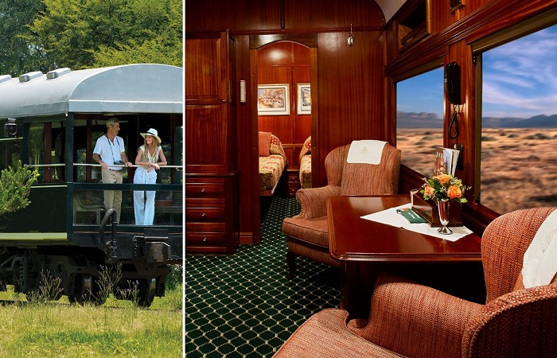
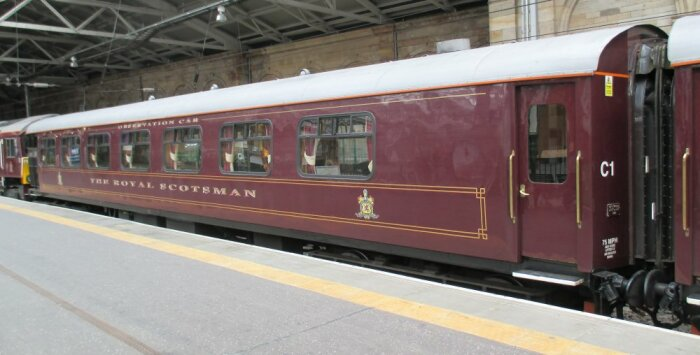
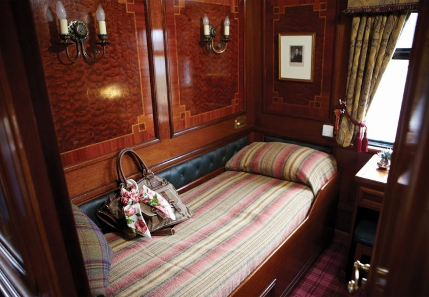
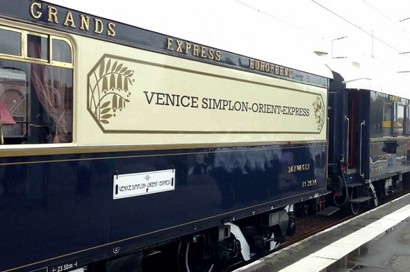
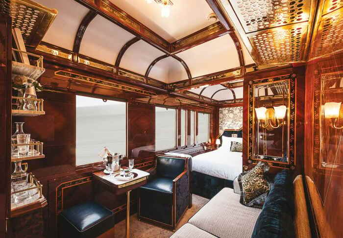
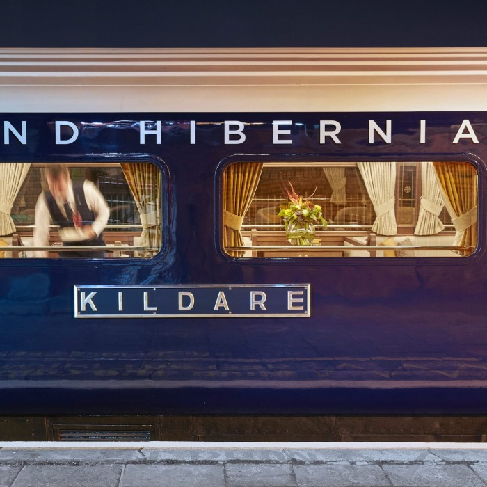
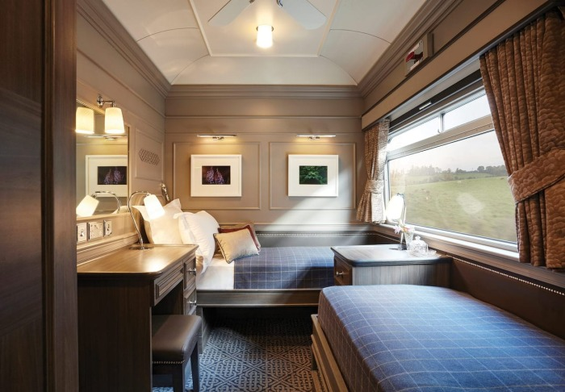

# Travel with comfort: Trains that are not inferior to five-star hotels in terms of luxury.

Railway travel is a special world, which has its own connoisseurs. And if you go on extra-class trains, it will create the illusion of a return to the past era, when there were no planes and cars just started to develop. Such trains exist, but you cannot buy tickets for them at a regular ticket office. They take tourists on special routes, combining luxury vacation in the compartment and entertainment on the way with exciting excursions at the stops.

1. Belmond Royal Scotsman, Scotland

Train Belmond Royal Scotsman offers a wide variety of routes, helping to get acquainted with all facets of Scotland. Landscape lovers, lovers of ancient castles, golf lovers and gourmets - whisky lovers will find tours to their liking. The trip takes place in the most comfortable atmosphere: the cars are decorated in impeccable classical style with luxurious fabrics and beautiful mahogany panels. Life on the train flows in a leisurely rhythm, but you won't be bored on the way. Passengers are offered a spa cabin, an observation car with panoramic windows, and dishes are prepared by chefs trained by such culinary stars as Michel Roux, Raymond Blanc, and Charlie Trotter.

2. Venice Simplon-Orient-Express, Europe

Venice Simplon-Orient-Express is the most famous composition, a true legend in the world of trains. Royalty, statesmen and various celebrities traveled on it, and writers and scriptwriters made it the place of their stories.

The composition consists of ancient cars of the 20-30s of the XX century, restored and decorated in Art Deco style. The luxurious train's interior literally breathes with history and creates a special atmosphere of sophistication and elegance of a bygone era. High quality service, excellent dishes and exquisite wine list are the integral part of the trip. Dress code also creates magic atmosphere. Jeans are considered to be mauveton here, and it is customary to come to the restaurant's car for dinner in evening dresses and tuxedos with bow ties.

Inquisitive fact from Novate.ru: The first trip the Orient-Express train made on October 4, 1883. Soon it was turned into a luxury vehicle and traveled on the route until 1960. The train owes its revival to Agatha Christie and Sidney Lumet, who filmed the novel by the writer. Orient-Express is the same train in which the detective action "Murder on the Orient Express" was unfolding. Lumet managed to find two rare cars for filming the film. Later they were sold at an auction to James Sherwood. 

3. Belmond Grand Hibernian, Ireland

Train Belmond Grand Hibernian introduces travelers to the beauty of Ireland. The train itself is also decorated in national colors. A huge team of specialists worked over the design and the train turned out to be stylish, permeated with vintage luxury. Its interior features traditional for county ornaments, and carriages were named after them. Moreover, almost all furniture items are made by Irish craftsmen: from stone stand, decorating the observation car, to half-wool carpets.

